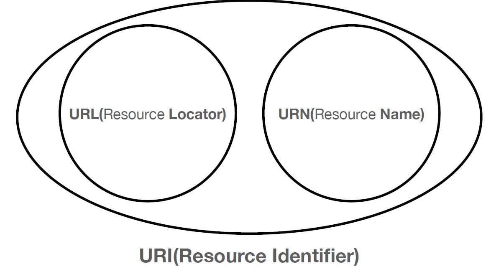
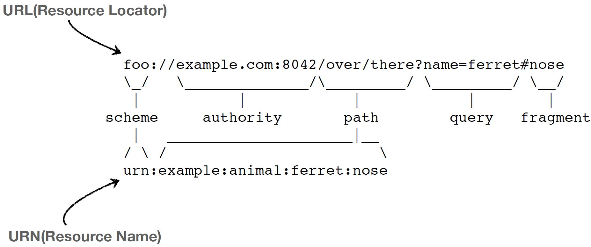
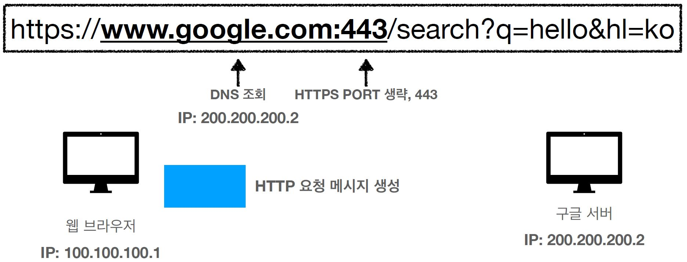
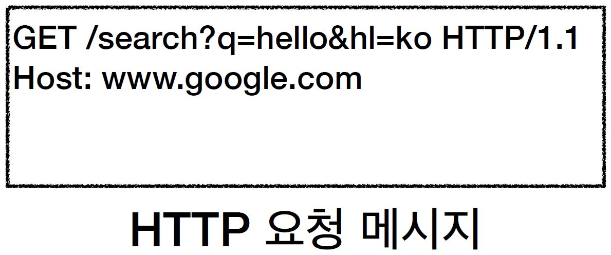
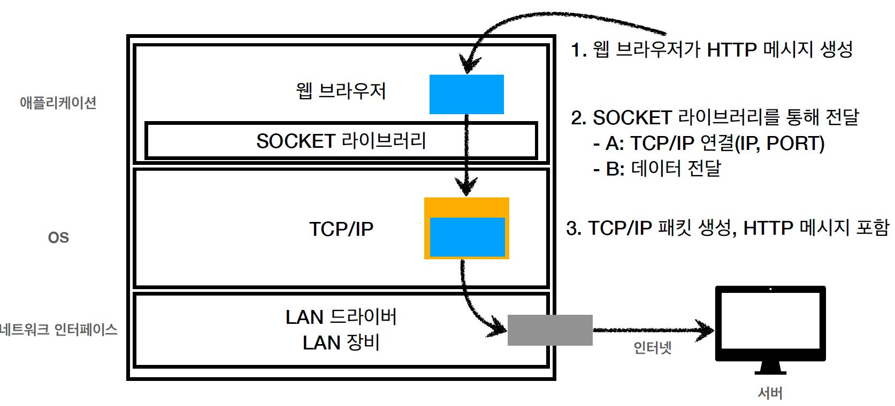
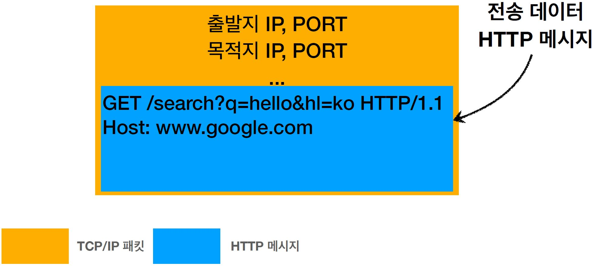
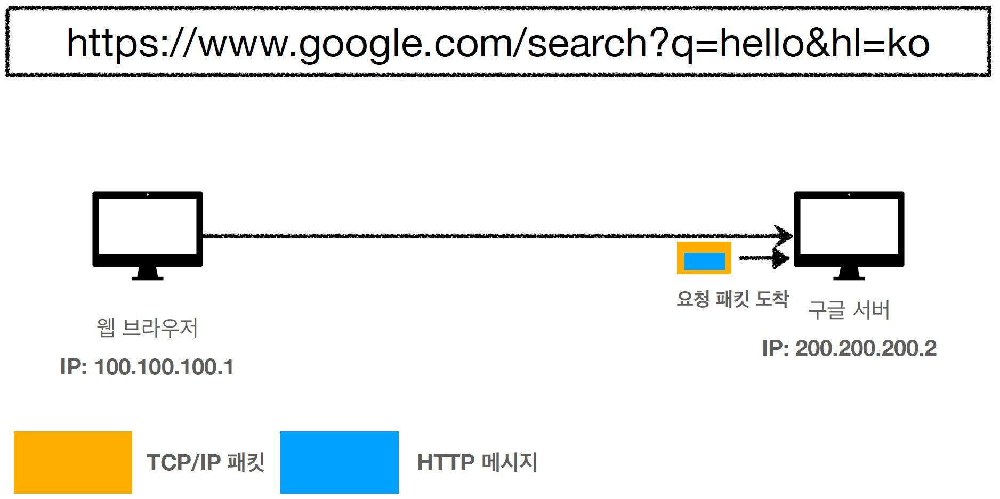
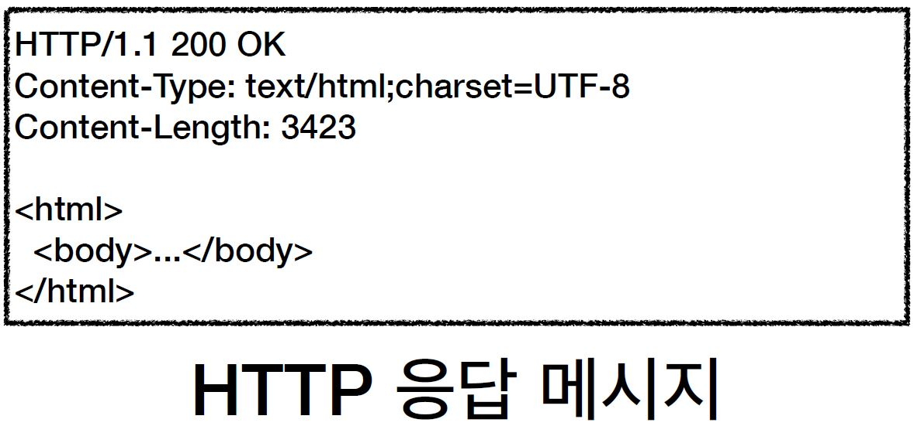
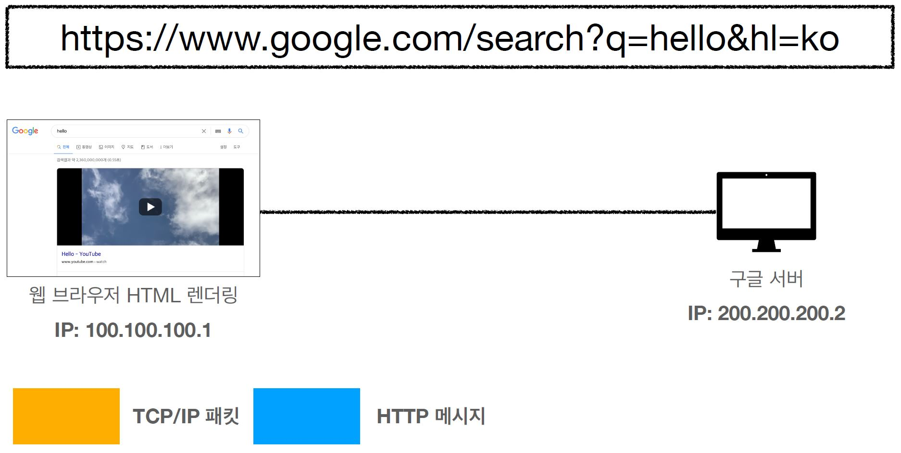

# URI

Uniform Resource Identifier 리소스를 식별하는 통합된 방법

## URI, URL, URN

`URI는 로케이터를(locator), 이름(name) 또는 둘 다 추가로 분류될 수 있다.`

URN은 쓰기 힘들어 거의 URL만 사용함.

### URI

- Uniform: 리소스 식별하는 통일된 방식
- Resource: 자원, URI로 식별할 수 있는 모든 것(제한 없음)
- Identifier: 다른 항목과 구분하는데 필요한 정보

### URL, URN

- URL - Locator: 리소스가 있는 위치를 지정
- URN - Name: 리소스에 이름을 부여
- 위치는 변할 수 있지만, 이름은 변하지 않는다.
- urn:isbn:8960777331 (어떤 책의 isbn URN)
- URN 이름만으로 실제 리소스를 찾을 수 있는 방법이 보편화 되지 않음
- 앞으로는 URI를 URL과 같은 의미로 이야기

## URL 전체 문법

- scheme://[userinfo@]host[:port}[/path][?query][#fragment]
- https://www.google.com:443/search?q=hello&hl=ko

### scheme

- 주로 프로토콜 사용
- 프로토콜: 어떤 방식으로 자원에 접근할 것인가 하는 약속 규칙
  - http, https, ftp 등등
- http는 80 포트, https는 443 포트를 사용, 포트는 생략 가능
- https는 http에 보안 추가 (HTTP Secure)

### userinfo

- URL에 사용자정보를 포함해서 인증
- 거의 사용하지 않음

### host

- 호스트명
- 도메인명 또는 IP 주소를 직접 사용가능

### PORT

- 포트(PORT)
- 접속 포트
- 일반적으로 생략, 생략시 http는 80, https는 443

### path

- 리소스 경로(path), 계층적 구조

### query

- key=value 형태
- ?로 시작, &로 추가 가능 ? keyA=valueA&keyB=valueB
- query parameter, query string 등으로 불림, 웹서버에 제공하는 파라미터, 문자 형태

### fragment

- html 내부 북마크 등에 사용
- 서버에 전송하는 정보 아님

# 웹 브라우저 요청 흐름

1. 웹 브라우저에서 DNS 서버를 조회, IP와 PORT정보를 찾아서 HTTP 요청 메시지를 생성
   
   
2. HTTP 메시지를 포함한 TCP/IP 패킷을 생성하여 인터넷으로 전송
   
   
3. 요청 패킷 도착시 HTTP 응답 패킷(메시지)을 전달
   
   
4. 브라우저는 HTTP 응답 메시지를 확인하여 웹 페이지를 랜더링함.
   
   
