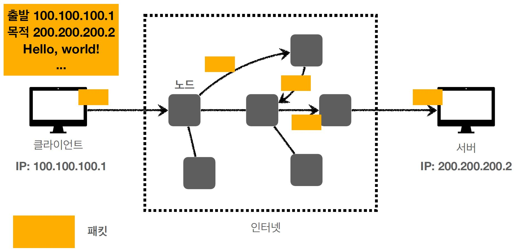

# IP(인터넷 프로토콜)

- 지정한 IP 주소(IP Address)에 데이터 전달.
- 패킷(Packet)이라는 통신단위로 전달.
  
  

## IP 프로토콜의 한계

- 비연결성
  - 패킷을 받을 대상이 없거나 서비스 불능 상태여도 패킷 전송.
- 비신뢰성
  - 중간에 패킷이 사라지면?
  - 패킷이 순서대로 안오면?
- 프로그램 구분
  - 같은 IP를 사용하는 서버에서 통신하는 애플리케이션이 둘 이상이면?

# TCP, UDP

위의 IP 프로토콜의 한계를 보완.

## 인터넷 프로토콜 스택의 4계층

위의 인터넷 프로토콜 4계층은 아래 이미지처럼 동작함.

## IP 패킷 정보

패킷은 패키지와 버킷의 합성어

## TCP/IP 패킷 정보

위의 IP 정보에 TCP와 관련된 정보(출발지 PORT, 목적지 PORT, 전송 제어, 순서, 검증 정보)를 추가,
IP만으로 해결 안됬던 비연결성, 비신뢰성 문제가 보완됨

## TCP 특징

전송 제어 프로토콜(Transmission Control Protocol)

- 연결지향 - TCP 3 way handshake (가상 연결)
- 데이터 전달 보증
- 순서 보장
- 신뢰할 수 있는 프로토콜
- 현재는 대부분의 애플리케이션에서 TCP를 사용

### TCP 3 way handshake

SYN, SYN+ACK, ACK 3번 주고 받는 과정을 통해 연결 가능을 판단함, 요즘엔 최적화가 되어서 3 ACK 과정에 데이터도 같이 전달함

### 데이터 전달 보증

TCP/IP에서는 데이터를 전달 받으면 이에 대해 응답을 보내줌
![데이터 전달 보증]

### 순서 보장

패킷의 순서가 안맞으면 맞도록 다시 보내달라고 요청함

## UDP 특징

사용자 데이터그램 프로토콜(User Datagram Protocol)

- 하얀 도화지에 비유(기능이 없음)
- 연결지향 X
- 데이터 전달 보증 X
- 순서 보장 X
- 데이터 전달 및 순서가 보장되지 않지만, 단순하고 빠름
- 정리
  - IP와 거의 같음 + PORT + 체크섬 정도 추가
  - 애플리케이션에서 추가 작업 필요, 마음대로 최적화 가능

# PORT

TCP/IP의 패킷 정보에 PORT라는 정보가 포함되어 있으며 같은 IP 내에서 프로세스를 구분할 수 있다.

- 0 ~ 65535 할당 가능
- 0 ~ 1023: 잘 알려진 포트로 사용하지 않는 것이 좋음
  - FTP - 20, 21
  - TELNET - 23
  - HTTP - 80
  - HTTPS - 443

# DNS

IP는 기억하기 어려우며 변경될 수 있다. 이를 보완하기 위해 나온 것이 DNS(Domain Name System)

- 전화번호부 같은 서버
- 도메인 명을 등록할 수 있으며 IP 주소로 변환해줌
  
