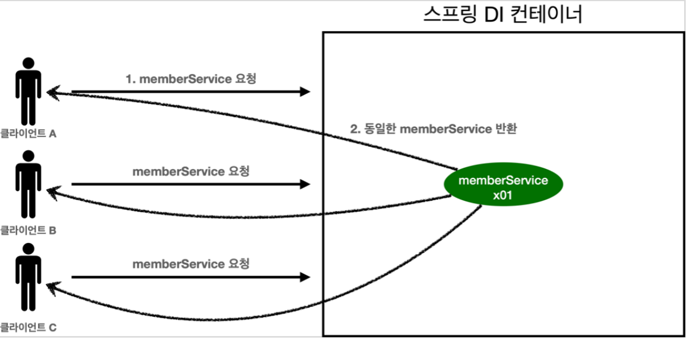

# 웹 애플리케이션과 싱글톤
- 스프링은 태생이 기업용 온라인 서비스 기술을 지원하기 위해 탄생.
- 대부분의 스프링 애플리케이션은 웹 애플리케이션.
- 웹 애플리케이션은 보통 여러 고객이 동시에 요청을 함.


# 싱글톤 패턴
- 싱글톤 패턴은 클래스의 인스턴스가 딱 1개만 생성되는 것을 보장하는 디자인 패턴.
- 객체 인스턴스를 2개 이상 생성하지 못하도록 막아야 함.
```
public class SingletonService {
    //1. static 영역에 객체를 딱 1개만 생성해둔다.
    private static final SingletonService instance = new SingletonService();
    
    //2. public으로 열어서 객체 인스터스가 필요하면 이 static 메서드를 통해서만 조회하도록 허용한다.
    public static SingletonService getInstance() {
        return instance;
    }

    //3. 생성자를 private으로 선언해서 외부에서 new 키워드를 사용한 객체 생성을 못하게 막는다.
    private SingletonService() {
    }

    public void logic() {
        System.out.println("싱글톤 객체 로직 호출");
    }
}
```
- 싱글톤 패턴을 적용하면 고객의 요청이 올 때마다 객체를 생성하는 것이 아닌, 이미 만들어진 객체를 공유해서 효율적으로 사용할 수 있다.

## 싱글톤 패턴 문제점
- 구현하는 코드 자체가 많이 들어감.
- 의존관계상 클라이언트가 구체 클레스에 의존. -> DIP 위반
- 클라이언트가 구체 클래스에 의존해서 OCP 원칙을 위반할 가능성이 높다.
- 테스트가 어려움.
- 내부 속성을 변경하거나 초기화 하기 어렵다.
- 유연성이 떨어짐.

# 싱글톤 컨테이너
스프링 컨테이너는 싱글톤 패턴의 문제점을 해결하면서, 객체 인스턴스를 싱글톤으로 관리한다. 이것이 바로 스프링 빈

- 스프링 컨테이너는 싱글톤 패턴을 따로 적용하지 않아도, 객체 인스턴스를 싱글톤으로 관리함.
- 싱글톤 패턴을 위한 지저분한 코드가 들어가지 않으며 DIP, OCP, 테스트, private 생성자로부터 자유롭게 싱글톤을 사용할 수 있다.



## 싱글톤 방식의 주의점
- 싱글톤 패턴이든, 스프링 싱글톤 컨테이너든, 객체 인스턴스를 하나만 생성해서 공유하기 때문에 상태를 유지(stateful)하게 설계하면 안됨.
- 무상태(stateless)로 설계해야 함.
  - 특정 클라이언트에 의존적인 필드가 있으면 안됨.
  - 특정 클라이언트가 값을 변경할 수 있는 필드가 있으면 안됨.
  - 가급적 읽기만 가능.
  - 필드 대신에 자바에서 공유되지 않는, 지역변수, 파라미터, ThreadLocal 등을 이용해야 함.

